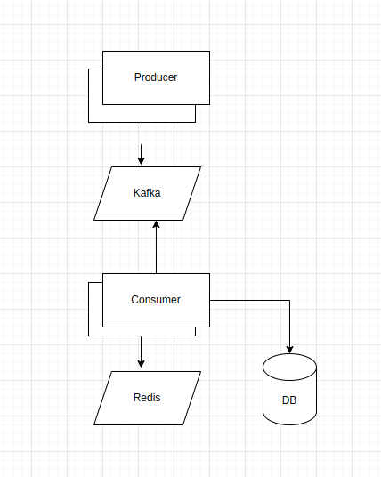

## Task

Develop a service for concurrent id generation for events with author names.

## Stack

- java 17
- Spring boot
- kafka
- redis
- postgres

## Prerequisites

- docker
- docker compose
- jvm 17
- maven

## Fast start

- `mvn package -Dmaven.test.skip`
- `docker compose up --scale consumer=2 --scale producer=2 --build`

## Kafka UI access

- open http://localhost:8082/
- configure kafka cluster: cluster name: any, Bootstrap servers: `PLAINTEXT://kafka`, port: `29092`

## Schema

